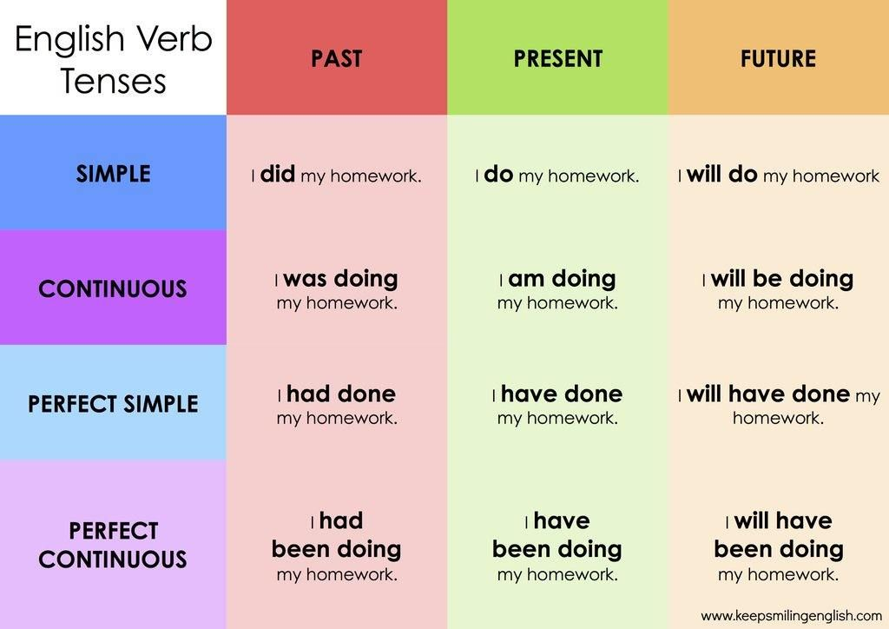

# Learning english

## Contents

- [Learning english](#learning-english)
  - [Contents](#contents)
  - [Grammar](#grammar)
    - [Verb tenses](#verb-tenses)
      - [Present tense](#present-tense)
        - [Present simple](#present-simple)
        - [Present continuous](#present-continuous)
        - [Present perfect](#present-perfect)
  - [Vocabulary](#vocabulary)
    - [Question tags](#question-tags)
      - [El verbo auxiliar APARECE en la oración](#el-verbo-auxiliar-aparece-en-la-oración)
        - [Verbo ‘to be’ (present & past continuous)](#verbo-to-be-present--past-continuous)
        - [Present & past perfect](#present--past-perfect)
        - [Will & modal verbs](#will--modal-verbs)
      - [El verbo auxiliar NO APARECE en la oración](#el-verbo-auxiliar-no-aparece-en-la-oración)
        - [Present & past simple](#present--past-simple)

## Grammar

### Verb tenses

#### Present tense

##### Present simple

We use the **present simple** for:

- Habits and routines with *always*, *sometimes*, *never*, *every day*...

> I **come** every year

- Things that are permanent or true for a long time.

> I **live** in Cáceres
>
> People still **eat** a lot of street food in Indonesia

- Verbs that describes states:

> The country's capital **has got** some fantastic street food.

|           | Form                                                                                | Example                              |   |   |
|-----------|-------------------------------------------------------------------------------------|--------------------------------------|---|---|
| Positive  | I / You / We / They + verb infinitive He / She / It + verb infitive + (-s) or (-es) | I go / You work She goes / it works  |   |   |
| Negative  | Subject + don't / doesn't + verb infinitive                                         | I don't live here / She doens't work |   |   |
| Questions | Question word + do / does + subject + verb infinitive                               | Where do you live? / Does she work?  |   |   |

##### Present continuous

We use the **present continuous** for things that:

- are happening at the moment of speaking:

> I'**m writing** from a bussy coffee shop

- are temporary and happening around now, but maybe not at this exact moment:

> I'**m working** in Madrid for a few days
>
> Now I'**m writing** a book about mexican food

- are changing over a period of time:

> My blog **is becoming** more popular every year
>
> More and more people **are visiting** Thailand on holidays these days

|           | Form                                               | Example                                                         |   |   |
|-----------|----------------------------------------------------|-----------------------------------------------------------------|---|---|
| Positive  | Subject + be + verb+ing                            | I'm working at the moment / She's becoming more popular         |   |   |
| Negative  | Subject + be not + verb+ing                        | I'm not working at the moment / She isn't becoming more popular |   |   |
| Questions | Question word + am / are / is + subject + verb+ing | Where are you talking to / Is she working today?                |   |   |

##### Present perfect

The **present perfect** is formed from the **present tense of the verb *have*** and the **past participle** of a verb.

| Forma | Sujeto | present tense of the verb **have** | past participle |
| ----- | ------ | ---------------------------------- | --------------- |
| Afirmativa | She | has | visited |
| Negativa | She | hast not / hasn't | visited |
| Interrogativa | Has | she | visited? |
| Interrogativa negativa | Has not / hasn't | she | visited? |

*To Walk*, present perfect:

| Afirmativa | Negativa | Interrogativa |
| ---------- | -------- | ------------- |
| I have walked | I haven't walked | Have I walked? |
| You have walked | You haven't walked | Have you walked? |
| He, she, it has walked | He, she, hasn't walked | Has he, she walked? |
| We have walked | We haven't walked | Have we walked? |
| You have walked | You haven't walked | Have you walked? |
| They have walked | They haven't walked | Have they walked? |

We use the present perfect:

- For something that **started in the past** and **continues in the present**:

> *They'**ve been married** for nearly fifty years.*
>
> *She **has lived** in Liverpool all her life.*

- When we are talking about our **experience up to the present**:

> I'**ve seen** that film before.
>
> I'**ve played** the guitar ever since I was a teenager.
>
>He **has written** three books and he is working on another one.

- We often use the adverb ever to talk about experience up to the present:

> My last birthday was the worst day I **have ever had.**

- And we use *'never'* for the negative form:

> Have you ever met George?
>
> Yes, but I'**ve never met** his wife.

- For something that happened in the past but is important in the present:

> Estela **has slept** much better tonight.
>
> I can't get in the house. I'**ve lost** my keys.

## Vocabulary

### Question tags

[Amigos ingleses: aprende a usar los question tags](https://www.amigosingleses.com/2018/02/22/aprende-usar-las-question-tags-en-ingles/)

O preguntas coletillas, son esas preguntas cortitas que se añaden al final de la frase porque no se está seguro de cierta información, o preguntas retóricas.

> Hablas italiano, verdad? / *You speak italian, **don't you***?

La estructura de la frase siempre será: **VERBO AUXILIAR + PRONOMBRE PERSONAL**

Además, si la frase es positiva, la *tag question* es negativa. Y al revés: si la frase es negativa, la *tag question* será positiva.

#### El verbo auxiliar APARECE en la oración

> You don't speak italian, **do you**?
>
> You don't know to drive, **do you**?

##### Verbo ‘to be’ (present & past continuous)

> German isn't easy, **is it**?
>
> It's snowing in England, **isn't it**?
>
> You aren't from Ireland, **are you**?
>
> Last week you were in London, **weren't you**?

##### Present & past perfect

> You have met my sister, **haven’t you**?
>
> She has eaten my cake, **hasn’t she**?
>
> You had spoken to Mary, **hadn’t you**?
>
> She has had a baby, **hasn't she**?
>
> You've been in Japan, **haven't you** ?
>
> The've come from the Berlin office, **haven't they**?
>
> You will not tell anybody my secret, **will you** ?
>
> I would never hurts you, **would I** ?
>
> I should phone my mother, **shouldn't I**?

##### Will & modal verbs

> It will be fine, **won’t it**?
>
> She won’t tell anybody, **will she**?
>
> You can’t take sugar, **can you**?
>
> I should study hard, **shouldn’t I**?
>
> He must be so sad, **musn’t he**?

#### El verbo auxiliar NO APARECE en la oración

##### Present & past simple

> Mary likes spicy food, **doesn't she**?
>
> He had to go home, **didn't it**?
>
> Sandra said she would come, **didn't she**?
>
> We're going to the party, **aren't we**?
>
> I can eat in class, **can't I**?
>
> Grandma can't have salt, **can she**?
>
> She has a baby, **doesn't she**?
>
> Arsenal tied last match, **did they**?
